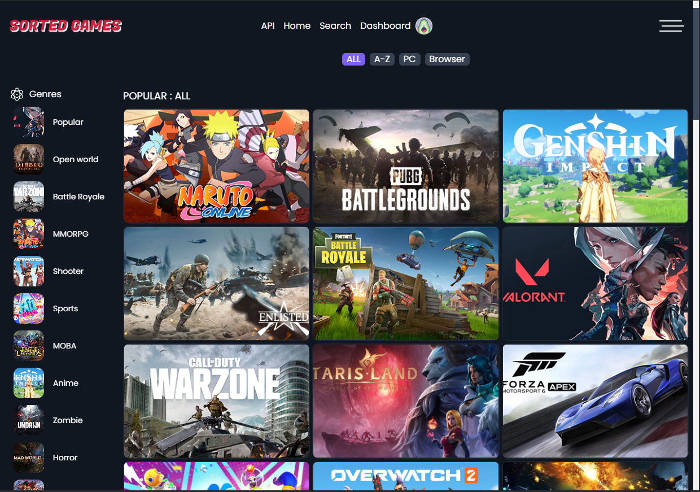
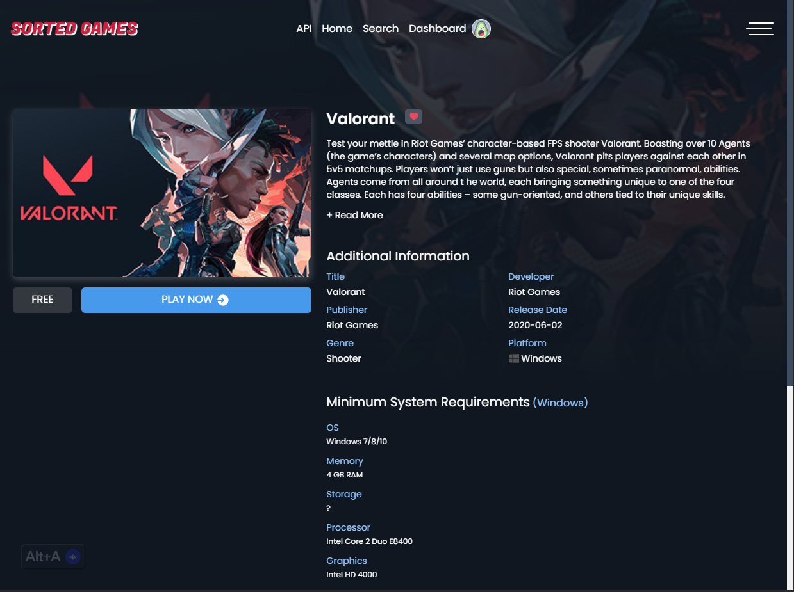

# SortedGames

SortedGames is a web application that allows users to browse and search for free-to-play games. The application provides detailed information about each game, including system requirements, screenshots, and links to play the games. It also features user authentication, allowing users to save their favorite games.

## Features

- **Game Browsing**: Explore a wide variety of free-to-play games categorized by genre.
- **Search Functionality**: Quickly find games using the search bar.
- **Game Details**: View detailed information about each game, including descriptions, system requirements, and screenshots.
- **User Authentication**: Sign up and log in using email and password or Google authentication.
- **Save Favorite Games**: Users can save their favorite games to their profile for easy access later.

## Technologies Used

- **Frontend**: React, TypeScript, Vite
- **State Management**: Redux Toolkit
- **Routing**: React Router
- **Firebase**: For user authentication and database storage
- **CSS Framework**: Tailwind CSS for styling
- **API**: Fetches game data from the Free-to-Play Games Database API

## Installation

To run the application locally, follow these steps:

Clone the repository:

```bash
git clone https://github.com/{your-username}/sortedGames.git
cd sortedGames
```

Install the dependencies

```bash
  npm install
```

Create a .env file in the root directory and add your Firebase and API keys:

```plaintext
  VITE_API_KEY=your_rapidapi_key
  VITE_FIREBASE_API_KEY=your_firebase_api_key
  VITE_FIREBASE_DB=your_firebase_database_url
```

Run the application:

```bash
  npm run dev
```

## Usage

- **Home Page**: Browse through popular games and categories.
- **Search**: Use the search bar to find specific games.
- **Game Details**: Click on a game card to view more details and system requirements.
- **Authentication**: Sign in or create an account to save your favorite games.

## Screenshots



